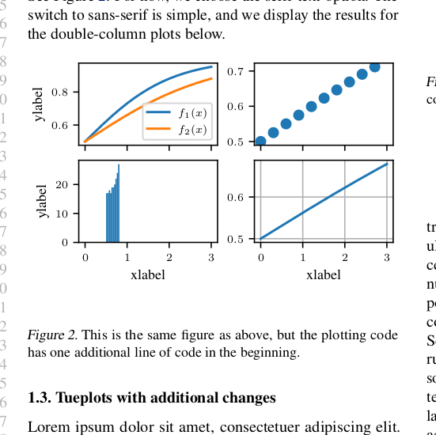
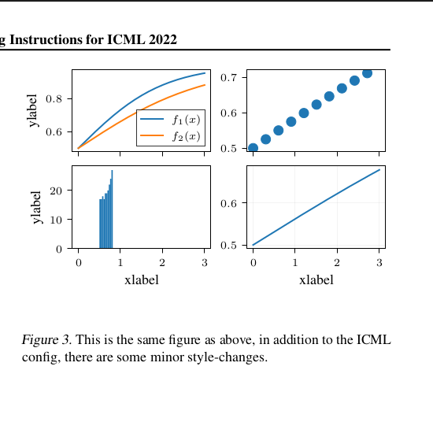

# TUEplots
[](https://pypi.org/project/tueplots/)
[](https://github.com/pnkraemer/tueplots)
[](https://github.com/pnkraemer/tueplots/actions?query=workflow%3Aci)
<a href="https://github.com/pnkraemer/tueplots/blob/master/LICENSE"></a>

Scientific plotting made easy, purely based on matplotlib.


Install via pip:
```commandline
pip install tueplots
```

or get the latest version from source:
```commandline
https://github.com/pnkraemer/tueplots.git
```

## Why?

`tueplots` helps you to create scientific plots that can be used in papers, presentations, posters, or other publications.
`tueplots` does not try to make your plots as beautiful as possible (who are we to judge your favourite color).
Instead, it makes it effortless to avoid common issues like too-small figures, inappropriate fontsizes, or inconsistencies among figures.
Because good-looking figures _are_ important. 

For example, consider the style tailored to the ICML2022 template.
(Left: default matplotlib, middle: one line of tueplots-code, right: two lines of tueplots-code)

<p align="center">



</p>


## Principles

_**`tueplots` has no internal state:**_
It only passes around dictionaries, whose key-value pairs match those that matplotlib uses.
Instead of updating global state, it makes it easy for you to do it yourself! 
If you want to globally change settings, pass them to `matplotlib.pyplot.rcParams.update()`.
If you only need them for specific contexts, pass them to `matpltlib.pyplot.rc_context()`.
`tueplots` makes the change easy, so you can make the easy change. This should make `tueplots` naturally compatible with other matplotlib extensions.
Usage examples are given below.


**_`tueplots` has no opinions:_**
It does not tell you what your figures should like like in the end, but helps you to tailor your plots to your own needs.
We like all the colors, frame-styles, markers, or linewidths.
But we _do_ think that figure sizes should match the text-width in your publication, 
and that the font-size in the plot should be readable, and similar to the rest of the paper/presentation/....


## Usage examples

`tueplots` provides some recipes for scientific plotting. 
For example, figure sizes can be tailored straightforwardly to some common journal page layouts:
```python
>>> from tueplots import figsizes
>>> figsizes.jmlr2001()["figure.figsize"]
(6.0, 1.8541019662496847)
```
within one module, the functions have a unified interface (wherever possible)
```python
>>> figsizes.jmlr2001(nrows=2)["figure.figsize"]
(6.0, 3.7082039324993694)
>>> 
>>> figsizes.neurips2021(nrows=3)["figure.figsize"]
(5.499999861629998, 5.098780278910587)
>>> 
>>> # The full output:
>>> figsizes.icml2022(nrows=4)
{'figure.autolayout': False,
 'figure.constrained_layout.use': True,
 'figure.figsize': (6.75, 8.343458848123582)}
```

There are also predefined color constants. For example, those based on the corporate design of the University of Tuebingen:
```python
>>> from tueplots.constants.color import rgb 
>>> 
>>> rgb.tue_dark
array([0.21568627, 0.25490196, 0.29019608])
>>>
>>> rgb.tue_gray
array([0.68627451, 0.70196078, 0.71764706])
```

Most of the output types of functions in `tueplots` are dictionaries that are directly compatible with matplotlib's `rcParam` language.
```python
>>> from tueplots import markers
>>> 
>>> markers.inverted()
{'lines.markeredgecolor': 'auto',
 'lines.markeredgewidth': 0.75,
 'lines.markerfacecolor': 'white'}


>>> import matplotlib.pyplot as plt

>>> # Use them as context managers:
>>> with plt.rc_context(markers.inverted()):
...     pass # do your plotting...

>>> # Or change your global configuration
>>> plt.rcParams.update(markers.inverted())
```

For more detailed tutorials, please have a look at the examples in the `examples/` directory.

## ICML 2022
If you're getting ready to submit your paper to ICML 2022, plug either of the following into your preamble. 
The signatures are interchangeable.
```python 
>>> from tueplots import bundles
>>> bundles.icml2022()
{'axes.labelsize': 9,
 'axes.titlesize': 9,
 'figure.autolayout': False,
 'figure.constrained_layout.use': True,
 'figure.figsize': (3.25, 2.0086104634371584),
 'font.family': 'sans-serif',
 'font.serif': ['Times'],
 'font.size': 9,
 'legend.fontsize': 7,
 'mathtext.bf': 'Times:bold',
 'mathtext.fontset': 'stix',
 'mathtext.it': 'Times:italic',
 'mathtext.rm': 'Times',
 'text.usetex': False,
 'xtick.labelsize': 7,
 'ytick.labelsize': 7}
>>> bundles.icml2022_tex(family="sans-serif", column="full", nrows=2)
{'axes.labelsize': 9,
 'axes.titlesize': 9,
 'figure.autolayout': False,
 'figure.constrained_layout.use': True,
 'figure.figsize': (6.75, 4.171729424061791),
 'font.family': 'sans-serif',
 'font.size': 9,
 'legend.fontsize': 7,
 'text.latex.preamble': '\\usepackage{times} '
                        '\\renewcommand{\\familydefault}{\\sfdefault} '
                        '\\usepackage{sansmath} \\sansmath',
 'text.usetex': True,
 'xtick.labelsize': 7,
 'ytick.labelsize': 7}
>>>
>>> # Plug any of those into either the rcParams or into an rc_context:
>>> plt.rcParams.update(bundles.icml2022())
>>> with plt.rc_context(bundles.icml2022_tex()):
...     pass
```
If you don't want a pre-packaged solution, at least fix your figure- and font-sizes as follows.
```python
>>> from tueplots import figsizes, fontsizes, fonts
>>> figsizes.icml2022()
{'figure.autolayout': False,
 'figure.constrained_layout.use': True,
 'figure.figsize': (6.75, 2.0858647120308955)}
>>> figsizes.icml2022(column="half", nrows=2, constrained_layout=True, tight_layout=False)
{'figure.autolayout': False,
 'figure.constrained_layout.use': True,
 'figure.figsize': (3.25, 4.017220926874317)}
>>> fontsizes.icml2022()
{'axes.labelsize': 9,
 'axes.titlesize': 9,
 'font.size': 9,
 'legend.fontsize': 7,
 'xtick.labelsize': 7,
 'ytick.labelsize': 7}
>>> fonts.icml2022()
{'font.family': 'serif',
 'font.serif': ['Times'],
 'mathtext.bf': 'Times:bold',
 'mathtext.fontset': 'stix',
 'mathtext.it': 'Times:italic',
 'mathtext.rm': 'Times',
 'text.usetex': False}
>>> fonts.icml2022(family="serif")
{'font.family': 'serif',
 'font.serif': ['Times'],
 'mathtext.bf': 'Times:bold',
 'mathtext.fontset': 'stix',
 'mathtext.it': 'Times:italic',
 'mathtext.rm': 'Times',
 'text.usetex': False}
>>> fonts.icml2022_tex(family="sans-serif")
{'font.family': 'sans-serif',
 'text.latex.preamble': '\\usepackage{times} '
                        '\\renewcommand{\\familydefault}{\\sfdefault} '
                        '\\usepackage{sansmath} \\sansmath',
 'text.usetex': True}
```
and if you want to give your plots a makeover (albeit a slightly opinionated one) with a single line of code,
consider the `axes.lines()` setting.
```python
>>> from tueplots import axes
>>> axes.lines()
{'axes.axisbelow': True,
 'axes.linewidth': 0.5,
 'grid.linewidth': 0.5,
 'legend.edgecolor': 'inherit',
 'lines.linewidth': 1.0,
 'patch.linewidth': 0.5,
 'xtick.major.size': 3.0,
 'xtick.major.width': 0.5,
 'xtick.minor.size': 2.0,
 'xtick.minor.width': 0.25,
 'ytick.major.size': 3.0,
 'ytick.major.width': 0.5,
 'ytick.minor.size': 2.0,
 'ytick.minor.width': 0.25}
>>> axes.lines(base_width=0.5)
{'axes.axisbelow': True,
 'axes.linewidth': 0.5,
 'grid.linewidth': 0.5,
 'legend.edgecolor': 'inherit',
 'lines.linewidth': 1.0,
 'patch.linewidth': 0.5,
 'xtick.major.size': 3.0,
 'xtick.major.width': 0.5,
 'xtick.minor.size': 2.0,
 'xtick.minor.width': 0.25,
 'ytick.major.size': 3.0,
 'ytick.major.width': 0.5,
 'ytick.minor.size': 2.0,
 'ytick.minor.width': 0.25}
```

## Troubleshooting

#### My version of matplotlib cannot find font XYZ?!
Some of the fonts that `tueplot` provides (e.g., `Times` or `Roboto`) needs to be installed on your machine before matplotlib can find it.
This means that you need to find a `.ttf` file online (e.g., `Roboto` family is available at Google fonts: https://fonts.google.com/specimen/Roboto),
download it, and install it. For Ubuntu, this means opening the file (with your font manager) and clicking `install`.
There are probably many other ways to do this.
Once the font is installed, delete your matplotlib cache (usually: `rm ~/.cache/matplotlib -rf`) and restart your notebook (not just the kernel).
See also https://stackoverflow.com/questions/42097053/matplotlib-cannot-find-basic-fonts/42841531.


## Contribution

To install `tueplots` with all development-related dependencies (tox, jupyter, etc.), run
```commandline
pip install .[dev]
```

Run the tests with pytest
```commandline
pytest
```

or use tox (which also runs the linter, and the python-code-snippets in this readme).
```commandline
tox
```

The CI checks for compliance of the code with black and isort, and runs the tests and the notebooks.
To automatically satisfy the former, there is a pre-commit that can be used (do this once):
```commandline
pip install pre-commit
pre-commit install
```
From then on, your code will be checked for isort and black compatibility automatically. 


## Related packages
There are similar packages to `tueplots` (with different foci, respectively):
* Seaborn: https://seaborn.pydata.org/index.html
* ProPlot: https://proplot.readthedocs.io/en/latest/cycles.html
* SciencePlots: https://github.com/garrettj403/SciencePlots
* MatplotX: https://github.com/nschloe/matplotx
* Themepy: https://github.com/petermckeeverPerform/themepy

If you know of any others, please open an issue/PR. 


# Miscellanous

`tueplots`has been developed at the University of Tübingen (hence the name).
